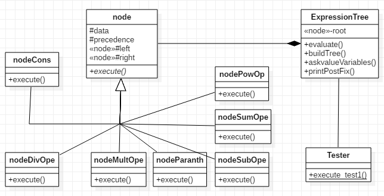
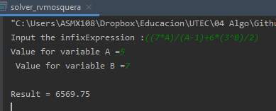

# Solver
> El árbol de expresiones sirve para resolver operaciones combinadas de tipo 7/4*((3+1)*3)+3. 

## Diagrama de Clases:

 
## Resultados
> Las pruebas se realizan invocando al método execute_test1 de la clase Tester.
```cpp
int main(int argc, char *argv[]) {

    Tester::execute_test1();

// #Test variables: Descomentar para probar expresiones con variables
 /*auto exp = new ExpressTree();
    string infixExpression = "";

    cout << "Input the infixExpression :";
    getline(cin, infixExpression);
    exp->generateFromInfixExp(infixExpression);
    exp->askvalueVariables();
    cout << " \nresult = " << exp->evaluate() << endl;
    exp->printPostFix();*/

    return EXIT_SUCCESS;
}
```
> Para probar las expresiones con variables como ((7*A)/A+6*(3^B)/2) solo es necesario descomentar las líneas. El resultado es similar al siguiente:
